<div align="center">

# MiniToo Studio

**Everything on the screen of a Divoom MiniToo speaker** — pictures and GIFs, a live mirror of
your desktop, clocks and dashboards, desktop notifications and the status of your Claude Code
sessions.

**English** · [Русский](README.ru.md)

[](https://www.rust-lang.org)
[](https://github.com/emilk/egui)
[](#platforms)
[](LICENSE)

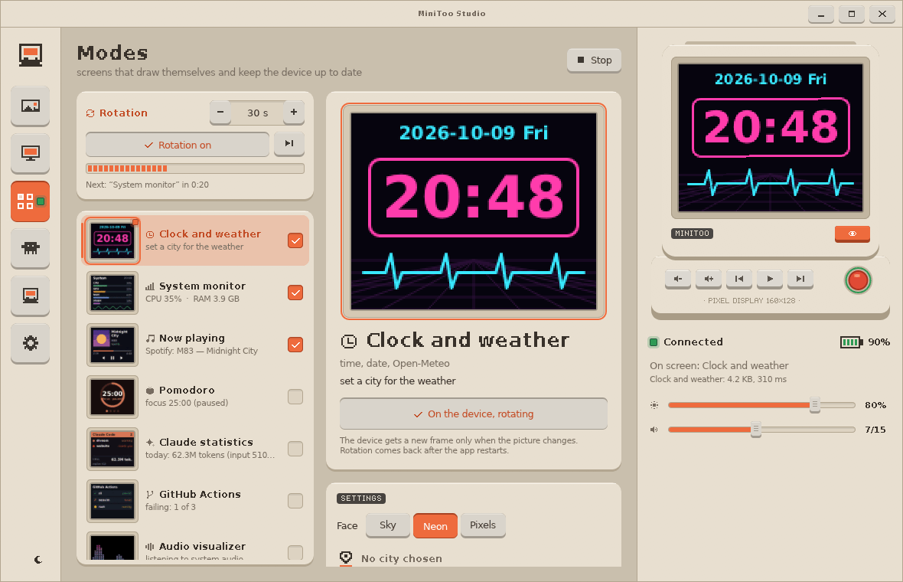

</div>

The [Divoom MiniToo](https://divoom.com) is a Bluetooth speaker shaped like a tiny beige retro
computer, with a 160×128 LCD for a screen. MiniToo Studio talks to it directly over Bluetooth
RFCOMM — no phone and no Divoom app — and turns that little screen into a desk companion.

<table>
  <tr>
    <td align="center">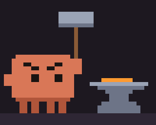<br><sub>working</sub></td>
    <td align="center">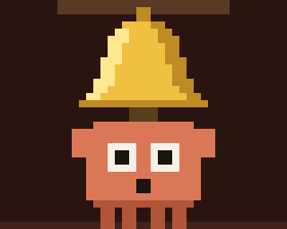<br><sub>needs you</sub></td>
    <td align="center">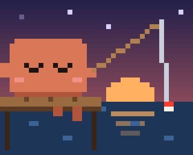<br><sub>resting</sub></td>
  </tr>
</table>

## Features

- 🖼️ **Pictures and GIFs.** PNG, JPEG, GIF, WebP, APNG, BMP, TIFF, SVG and JPEG XL (AVIF and HEIC
  through ImageMagick, if installed). Crop with a draggable 5:4 frame, fit or stretch, pixel-art
  mode with nearest-neighbour scaling. Everything you send lands in a local gallery with
  favourites.
- 🖥️ **Screen mirroring.** Pick a monitor or a window through the desktop portal and stream an
  area of it at up to 20 fps. The choice is remembered, so the dialog shows up only once.
- ⏱️ **Live modes** that draw themselves and keep the speaker up to date:
  clock & weather (Open-Meteo, three faces), system monitor (CPU, GPU, RAM, VRAM, temperatures),
  now playing (cover and track from any MPRIS player), Pomodoro, Claude Code token statistics,
  GitHub Actions status and an audio spectrum visualizer. Several modes can take turns in a
  **rotation**.
- 🤖 **Claude Code status.** One click installs hooks into `~/.claude/settings.json`; from then on
  the speaker shows whether Claude is working, resting or **waiting for you** — with the project
  name and the question (“Allow Bash?”). 18 hand-drawn pixel animations, or your own GIF.
- 🔔 **Desktop notifications** as cards with the sender's icon, on top of whatever is showing.
- 🔒 **Screen lock awareness.** When the computer locks, the speaker shows a clock and dims; after
  unlocking everything comes back as it was.
- 🔊 **Speaker control.** Brightness, volume, playback, screen on/off, clock sync, battery level
  (via BlueZ) and the speaker's built-in screens and games.
- 🧩 **Scriptable.** A local HTTP API and a command line: send a picture from a script, switch
  modes, push a notification card from your build.
- 🌐 **English and Russian**, 24/12-hour time and date formats; translations are plain text files.
- 🎨 **An interface that looks like the speaker**: plastic panels, keys with travel, pixel text,
  a beige and a night theme.

<p align="center">
  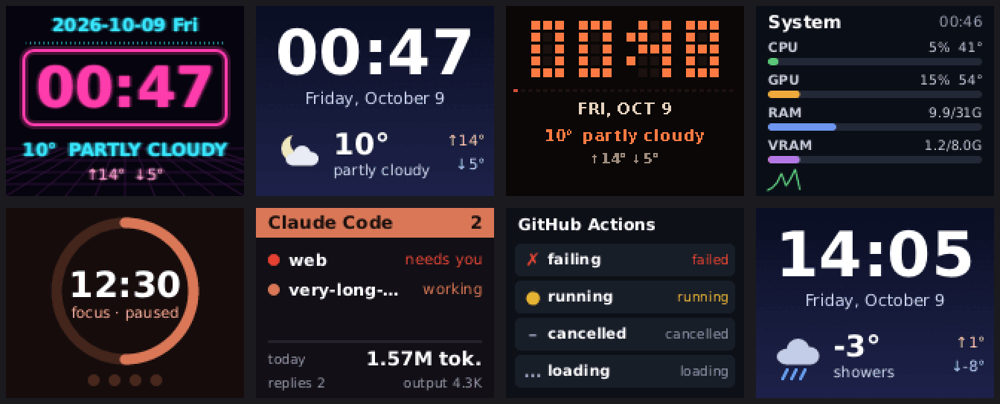
  <br><sub>Live modes as the speaker shows them (enlarged ×2)</sub>
</p>

## Screenshots

| | |
|:---:|:---:|
| 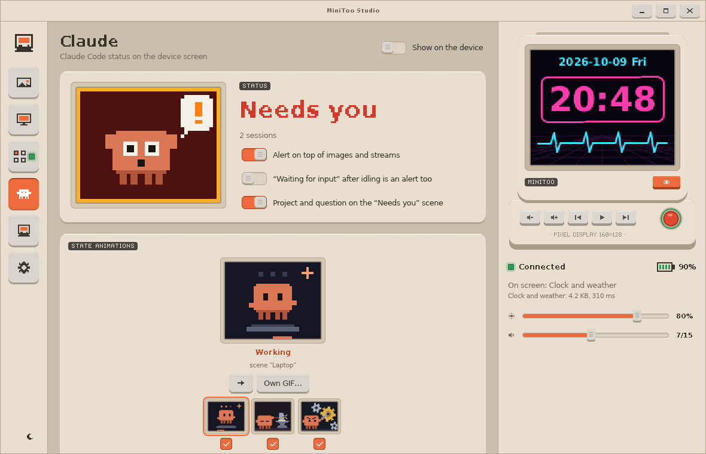<br><sub>Claude Code status and scenes</sub> | 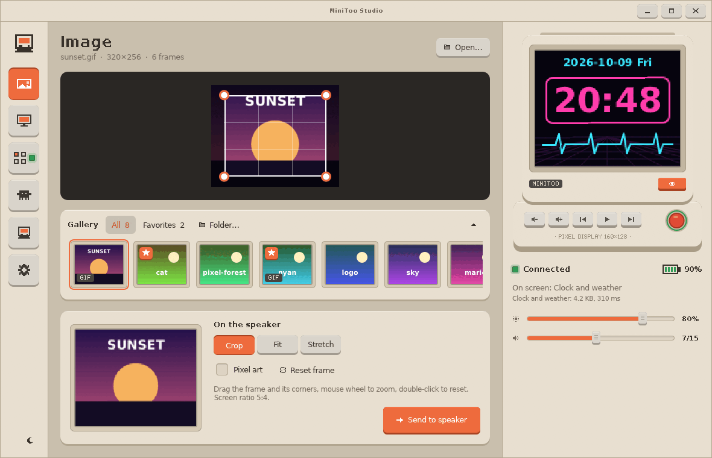<br><sub>Pictures, crop frame and gallery</sub> |
| 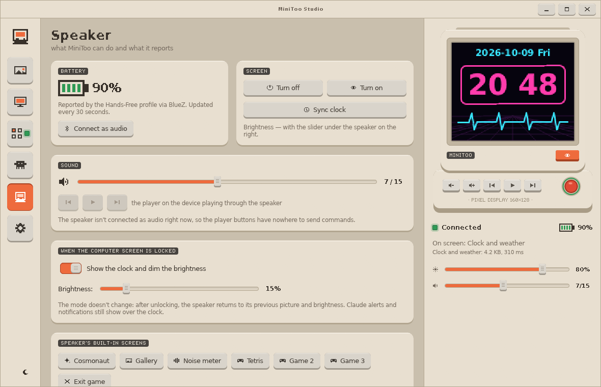<br><sub>Speaker: battery, sound, lock screen, built-in screens</sub> | 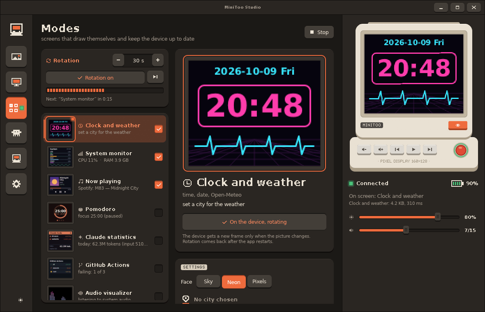<br><sub>Night theme</sub> |

<details>
<summary><b>All 18 Claude scenes</b></summary>
<br>
<p align="center">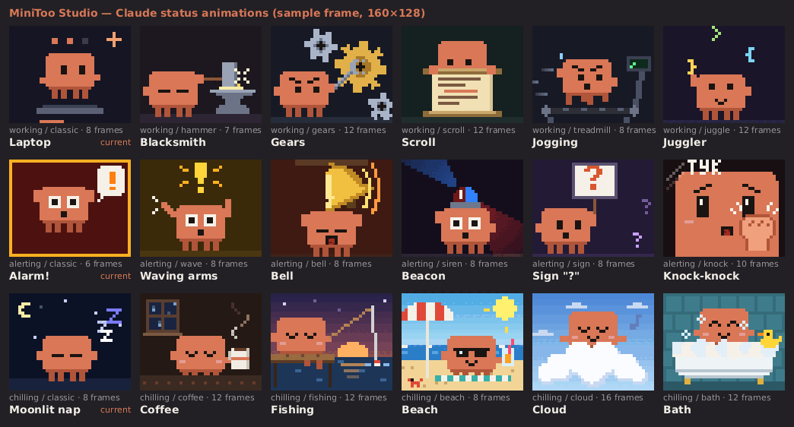</p>
<p align="center">
  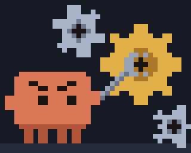
  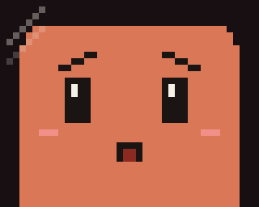
  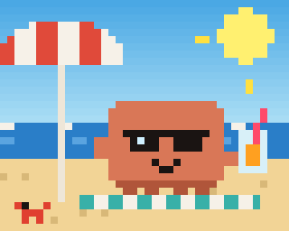
</p>
</details>

## Getting started

### What you need

- A **Divoom MiniToo** and a Bluetooth adapter. Pairing is not required: the app connects to
  RFCOMM channel 1 by MAC address. **Settings → Speaker → Find** scans for it.
- **Linux** with KDE Plasma on Wayland is the main target; see [Platforms](#platforms) for the rest.

### Build

The recommended way builds in a container, so nothing is installed on the host — only Docker is
needed:

```bash
./build.sh            # release build + tests → build/minitoo-studio
./build.sh --windows  # also type-check the Windows target
```

Or with a local toolchain (Rust 1.88+, PipeWire headers, clang for bindgen, pkg-config):

```bash
# Arch / CachyOS: sudo pacman -S rustup clang pkgconf libpipewire
# Debian / Ubuntu: sudo apt install clang pkg-config libpipewire-0.3-dev
cargo build --release
```

### Run

```bash
./build/minitoo-studio                       # window + tray icon
./build/minitoo-studio --hidden              # start in the tray
./build/minitoo-studio --headless            # no window or tray: speaker + HTTP API only
./packaging/install-desktop.sh --autostart   # app menu entry and autostart (--uninstall to undo)
```

On the first start open **Settings**, put in the speaker's MAC address (or press **Find**), and
you are set. Closing the window keeps the app running in the tray.

Settings are stored in `~/.config/minitoo-studio/minitoo-studio.conf`, the gallery in
`~/.local/share/minitoo-studio/MiniToo Studio/gallery/`.

### Claude Code

Open the **Claude** page and press **Install hooks**. The app backs up `~/.claude/settings.json`,
adds a small `curl` hook for each session event and leaves your other hooks alone. New Claude Code
sessions start reporting their status; turn on **Show on the device** to give the speaker to
Claude. Alerts can also break through pictures and streams.

## Command line

```
minitoo-studio                      window + tray
minitoo-studio --hidden             start in the tray
minitoo-studio --headless           no window or tray (speaker and HTTP API only)
minitoo-studio --send f.gif [--fit crop|fit|stretch]   via the running app, otherwise directly
minitoo-studio --mode claude|idle   switch the running app
minitoo-studio --state working|alerting|chilling
minitoo-studio --status             JSON /status
minitoo-studio --no-device          don't connect at startup
minitoo-studio --image f.png        open an image at startup
minitoo-studio --debug              log in the right panel, protocol diagnostics
```

Only one instance runs at a time: a second launch brings the window of the first one forward.

## HTTP API

The app listens on `127.0.0.1:47800` (local only; the port is configurable).

| Request | Body | What it does |
|---|---|---|
| `POST /show` | `{"path": "…", "fit": "crop\|fit\|stretch"}` | open a file and send it |
| `POST /notify` | `{"app", "summary", "body", "icon"}` | show a notification card |
| `POST /live/<id>` | — | show a live mode: `clock`, `sysmon`, `nowplaying`, `pomodoro`, `claudestats`, `github`, `visualizer` |
| `POST /mode/<claude\|idle>` | — | give the screen to Claude, or release it |
| `POST /state/<working\|alerting\|chilling>` | — | fake a Claude session in that state |
| `POST /hook` | Claude Code hook JSON | what the installed hooks call |
| `GET /status` | — | Claude state and sessions |
| `GET /device` | — | connection, speaker info, last transfer |
| `GET /frame/<id\|device>` | — | PNG of a mode's frame, or of what the speaker shows |

```bash
curl -X POST -d '{"app":"build","summary":"Build finished","body":"0 errors"}' \
     http://127.0.0.1:47800/notify
```

## Platforms

| | Linux (KDE / Wayland) | Windows | macOS |
|---|---|---|---|
| Speaker link | RFCOMM socket by MAC or `/dev/rfcommN` | RFCOMM socket by MAC or COM port | serial port of the paired speaker |
| Pictures, gallery, live modes, Claude, HTTP, CLI | ✅ | ✅ | ✅ |
| Screen mirroring | portal + PipeWire | xcap | xcap |
| Audio visualizer | PipeWire | cpal (loopback) | cpal (input) |
| Now playing, notifications, lock screen, battery | D-Bus | — | — |
| Tray | StatusNotifierItem | tray-icon | tray-icon |

Linux is tested on a real speaker. The Windows build is type-checked
(`./build.sh --windows`) but not tried on a device yet; macOS is untested.

## Translations

English and Russian are built in. To add a language, press **Settings → Language and formats →
Translations folder**, copy `en.lang.template` to `<code>.lang` and translate the lines you want —
anything missing falls back to English. The format is described in
[`locales/README.md`](locales/README.md).

## How it works

```
src/
  protocol.rs   message frames, reply parsing, media encoding (zstd with the speaker's parameters)
  transport.rs  RFCOMM: AF_BLUETOOTH (Linux), AF_BTH (Windows), serial port (macOS)
  worker.rs     the link thread: reconnects, command queue, "latest wins", keepalive
  app.rs        the controller: what is on screen, Claude, lock, rotation, mirroring, HTTP routes
  api.rs        core ↔ UI contract: an immutable Snapshot plus Commands
  live/         live modes on top of a shared LiveMode contract
  faces.rs      Claude scenes, drawn pixel by pixel on a 40×32 grid
  platform/     screen capture (portal + PipeWire), notifications, lock, BlueZ, tray, icons
  ui/           the egui interface
```

All logic runs in one event loop: UI commands, HTTP, link events, mode timers, D-Bus and capture
arrive as messages and are handled one at a time. The window only reads a snapshot of the state
and sends commands, so it can close and reopen while the core and the tray keep running.

A few things the speaker taught along the way:

- the screen is **160×128**, not 128×128;
- media must be zstd with a 2<sup>17</sup> window and the content size in the header, otherwise
  the speaker silently drops it;
- every transfer costs ~0.3 s regardless of size, but the speaker plays up to 92 frames on its
  own — so anything predictable (a clock, a timer) is sent **a minute at a time**, not every
  second.

The full reverse-engineered protocol and the behaviour of every screen are written down in
[`docs/SPEC.md`](docs/SPEC.md) (in Russian).

### Tests and debugging

```bash
cargo test --lib
```

Covers the protocol (test vectors, checksum, packets, zstd window and header), the link against a
simulated speaker (data requests, chunk resend, "latest wins"), Claude scenes, sessions and hooks,
rotation, gallery, settings and media. For a look without a speaker, `GET /frame/device` returns
exactly what was last sent to the screen, and `cargo run --example ui_preview` opens the window
with a mock core.

## License

[MIT](LICENSE) © John Henry Spike

MiniToo Studio is an independent project and is not affiliated with Divoom or Anthropic.
