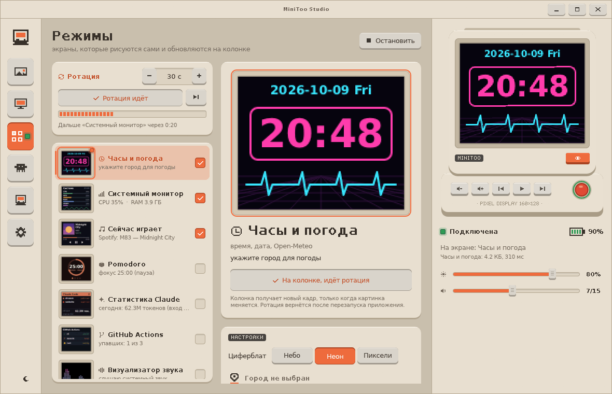
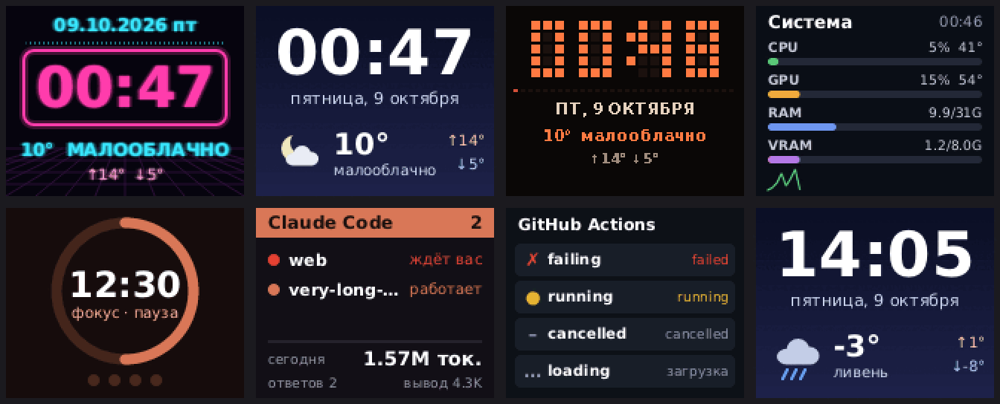
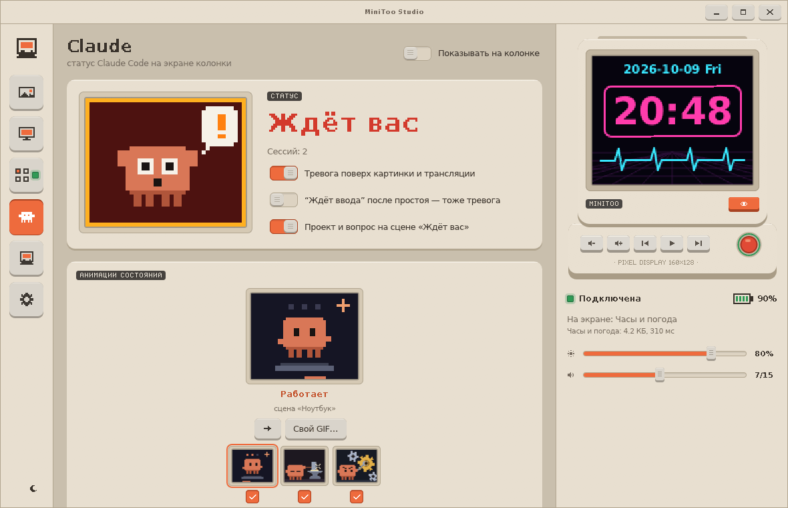
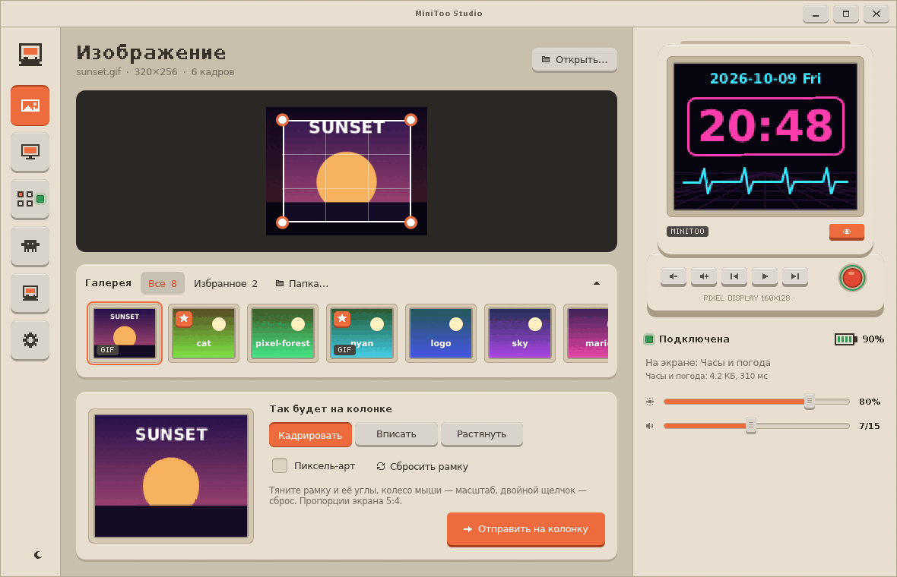
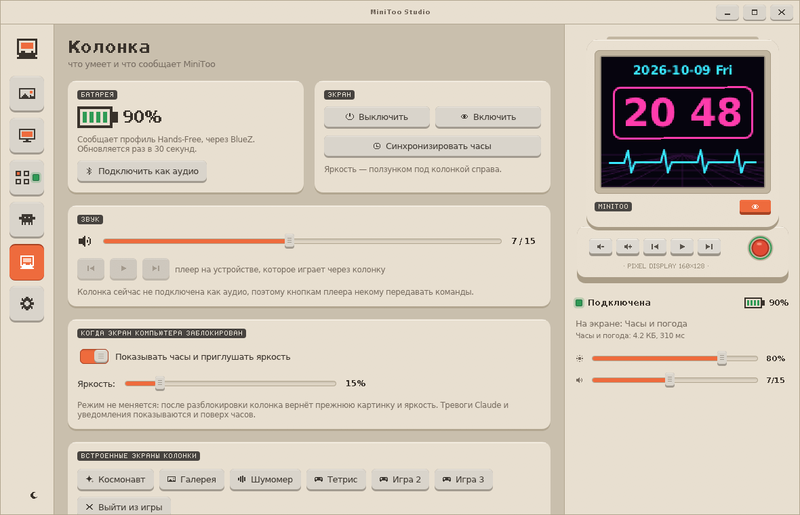
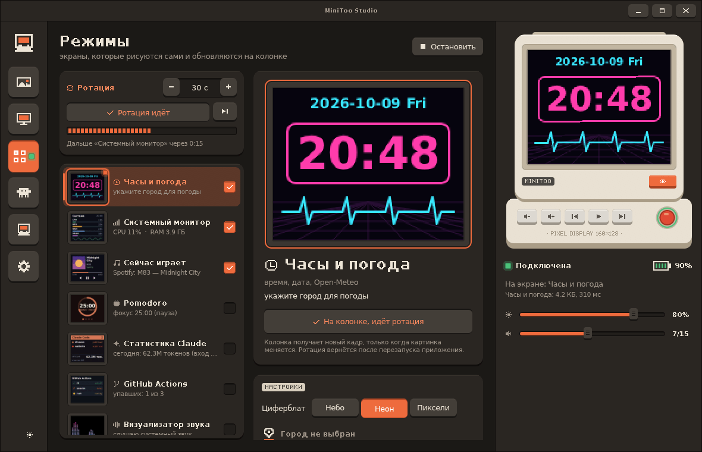
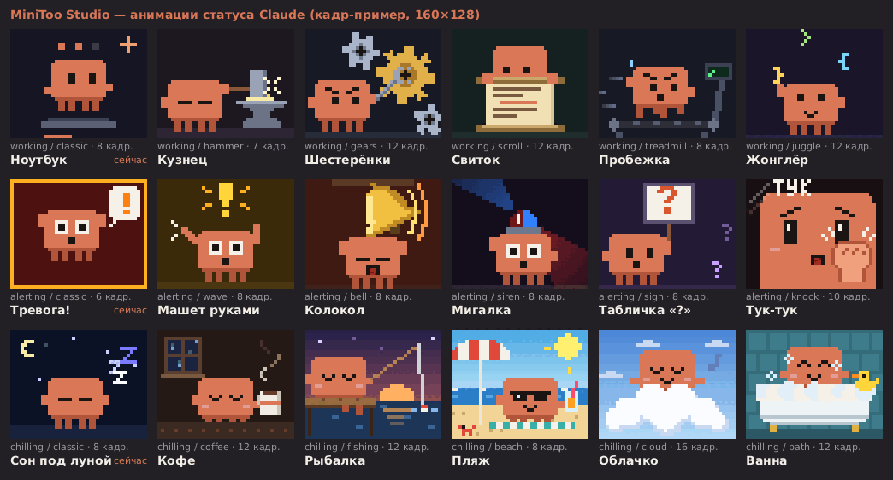

<div align="center">

# MiniToo Studio

**Всё на экране колонки Divoom MiniToo** — картинки и GIF, трансляция рабочего стола, часы и
панели, уведомления и статус ваших сессий Claude Code.

[English](README.md) · **Русский**

[](https://www.rust-lang.org)
[](https://github.com/emilk/egui)
[](#платформы)
[](LICENSE)



</div>

[Divoom MiniToo](https://divoom.com) — Bluetooth-колонка в виде маленького бежевого
ретро-компьютера с LCD-экраном 160×128. MiniToo Studio общается с ней напрямую по Bluetooth
RFCOMM — без телефона и приложения Divoom — и превращает этот экранчик в настольного компаньона.

<table>
  <tr>
    <td align="center"><br><sub>работает</sub></td>
    <td align="center"><br><sub>ждёт вас</sub></td>
    <td align="center"><br><sub>отдыхает</sub></td>
  </tr>
</table>

## Возможности

- 🖼️ **Картинки и GIF.** PNG, JPEG, GIF, WebP, APNG, BMP, TIFF, SVG и JPEG XL (AVIF и HEIC —
  через ImageMagick, если он установлен). Кадрирование рамкой 5:4, «вписать» или «растянуть»,
  режим пиксель-арта с увеличением ближайшим соседом. Всё отправленное попадает в локальную
  галерею с избранным.
- 🖥️ **Трансляция экрана.** Выберите монитор или окно через портал рабочего стола и транслируйте
  его область со скоростью до 20 кадров/с. Выбор запоминается, диалог появляется один раз.
- ⏱️ **Живые режимы**, которые рисуют себя сами и держат колонку в актуальном состоянии:
  часы и погода (Open-Meteo, три циферблата), системный монитор (CPU, GPU, RAM, VRAM,
  температуры), «Сейчас играет» (обложка и трек из любого MPRIS-плеера), Pomodoro, статистика
  токенов Claude Code, статус GitHub Actions и визуализатор спектра звука. Несколько режимов
  можно показывать по очереди — **ротацией**.
- 🤖 **Статус Claude Code.** Одна кнопка ставит хуки в `~/.claude/settings.json`, и колонка
  показывает, работает ли Claude, отдыхает или **ждёт вас** — с именем проекта и вопросом
  («Разрешить Bash?»). 18 нарисованных вручную пиксельных анимаций или свой GIF.
- 🔔 **Уведомления рабочего стола** — карточками со значком отправителя поверх того, что на экране.
- 🔒 **Блокировка экрана.** Когда компьютер заблокирован, колонка показывает часы и приглушает
  яркость; после разблокировки всё возвращается как было.
- 🔊 **Управление колонкой.** Яркость, громкость, воспроизведение, включение экрана, синхронизация
  часов, заряд батареи (через BlueZ), встроенные экраны и игры колонки.
- 🧩 **Автоматизация.** Локальный HTTP API и командная строка: отправить картинку из скрипта,
  переключить режим, показать карточку об окончании сборки.
- 🌐 **Русский и английский**, 24/12-часовой формат времени и форматы даты; переводы — обычные
  текстовые файлы.
- 🎨 **Интерфейс в стиле самой колонки**: пластиковые панели, клавиши с ходом, пиксельный текст,
  бежевая и ночная темы.

<p align="center">
  
  <br><sub>Живые режимы так, как их показывает колонка (увеличено ×2)</sub>
</p>

## Скриншоты

| | |
|:---:|:---:|
| <br><sub>Статус Claude Code и сцены</sub> | <br><sub>Картинки, рамка кадрирования и галерея</sub> |
| <br><sub>Колонка: батарея, звук, блокировка, встроенные экраны</sub> | <br><sub>Ночная тема</sub> |

<details>
<summary><b>Все 18 сцен Claude</b></summary>
<br>
<p align="center"></p>
<p align="center">
  
  
  
</p>
</details>

## Начало работы

### Что понадобится

- **Divoom MiniToo** и Bluetooth-адаптер. Сопряжение не нужно: приложение подключается к
  RFCOMM-каналу 1 по MAC-адресу. Кнопка **Настройки → Колонка → Найти** ищет колонку.
- **Linux** с KDE Plasma на Wayland — основная платформа; про остальные — в разделе
  [Платформы](#платформы).

### Сборка

Рекомендуемый способ собирает в контейнере, на хост ничего не ставится — нужен только Docker:

```bash
./build.sh            # release-сборка и тесты → build/minitoo-studio
./build.sh --windows  # плюс проверка типов под Windows
```

Или локальным тулчейном (Rust 1.88+, заголовки PipeWire, clang для bindgen, pkg-config):

```bash
# Arch / CachyOS: sudo pacman -S rustup clang pkgconf libpipewire
# Debian / Ubuntu: sudo apt install clang pkg-config libpipewire-0.3-dev
cargo build --release
```

### Запуск

```bash
./build/minitoo-studio                       # окно + значок в трее
./build/minitoo-studio --hidden              # сразу в трей
./build/minitoo-studio --headless            # без окна и трея: колонка + HTTP API
./packaging/install-desktop.sh --autostart   # ярлык в меню и автозапуск (--uninstall — убрать)
```

При первом запуске откройте **Настройки**, введите MAC-адрес колонки (или нажмите **Найти**) —
и всё готово. Закрытое окно оставляет приложение работать в трее.

Настройки хранятся в `~/.config/minitoo-studio/minitoo-studio.conf`, галерея — в
`~/.local/share/minitoo-studio/MiniToo Studio/gallery/`.

### Claude Code

Откройте страницу **Claude** и нажмите **Установить хуки**. Приложение делает резервную копию
`~/.claude/settings.json`, добавляет короткий `curl`-хук на каждое событие сессии и не трогает
ваши остальные хуки. Новые сессии Claude Code начнут присылать статус; включите **Показывать на
колонке**, чтобы отдать экран Claude. Тревога может прерывать и картинки, и трансляцию.

## Командная строка

```
minitoo-studio                      окно + трей
minitoo-studio --hidden             сразу в трей
minitoo-studio --headless           без окна и трея (только колонка и HTTP API)
minitoo-studio --send f.gif [--fit crop|fit|stretch]   через запущенное приложение, иначе напрямую
minitoo-studio --mode claude|idle   переключить запущенное приложение
minitoo-studio --state working|alerting|chilling
minitoo-studio --status             JSON /status
minitoo-studio --no-device          не подключаться при запуске
minitoo-studio --image f.png        открыть картинку при запуске
minitoo-studio --debug              журнал в правой панели, диагностика протокола
```

Работает только один экземпляр: повторный запуск выводит на передний план окно первого.

## HTTP API

Приложение слушает `127.0.0.1:47800` (только локально; порт настраивается).

| Запрос | Тело | Что делает |
|---|---|---|
| `POST /show` | `{"path": "…", "fit": "crop\|fit\|stretch"}` | открыть файл и отправить |
| `POST /notify` | `{"app", "summary", "body", "icon"}` | показать карточку уведомления |
| `POST /live/<id>` | — | показать живой режим: `clock`, `sysmon`, `nowplaying`, `pomodoro`, `claudestats`, `github`, `visualizer` |
| `POST /mode/<claude\|idle>` | — | отдать экран Claude или освободить его |
| `POST /state/<working\|alerting\|chilling>` | — | фиктивная сессия Claude в этом состоянии |
| `POST /hook` | JSON хука Claude Code | то, что вызывают установленные хуки |
| `GET /status` | — | состояние Claude и сессии |
| `GET /device` | — | подключение, сведения о колонке, последняя передача |
| `GET /frame/<id\|device>` | — | PNG кадра режима или того, что сейчас на колонке |

```bash
curl -X POST -d '{"app":"build","summary":"Сборка готова","body":"0 ошибок"}' \
     http://127.0.0.1:47800/notify
```

## Платформы

| | Linux (KDE / Wayland) | Windows | macOS |
|---|---|---|---|
| Связь с колонкой | RFCOMM-сокет по MAC или `/dev/rfcommN` | RFCOMM-сокет по MAC или COM-порт | последовательный порт сопряжённой колонки |
| Картинки, галерея, живые режимы, Claude, HTTP, CLI | ✅ | ✅ | ✅ |
| Трансляция экрана | портал + PipeWire | xcap | xcap |
| Визуализатор звука | PipeWire | cpal (loopback) | cpal (вход) |
| Сейчас играет, уведомления, блокировка, батарея | D-Bus | — | — |
| Трей | StatusNotifierItem | tray-icon | tray-icon |

Linux проверен на настоящей колонке. Сборка под Windows проходит проверку типов
(`./build.sh --windows`), но на устройстве ещё не запускалась; macOS не проверялся.

## Переводы

Русский и английский встроены. Чтобы добавить язык, нажмите **Настройки → Язык и форматы → Папка
переводов**, скопируйте `en.lang.template` в `<код>.lang` и переведите нужные строки — всё
непереведённое показывается по-английски. Формат описан в [`locales/README.md`](locales/README.md).

## Как это устроено

```
src/
  protocol.rs   кадры сообщений, разбор ответов, кодирование медиа (zstd с параметрами колонки)
  transport.rs  RFCOMM: AF_BLUETOOTH (Linux), AF_BTH (Windows), последовательный порт (macOS)
  worker.rs     поток канала: переподключение, очередь команд, «последний побеждает», keepalive
  app.rs        контроллер: что на экране, Claude, блокировка, ротация, трансляция, HTTP-маршруты
  api.rs        контракт ядро ↔ интерфейс: неизменяемый Snapshot и команды
  live/         живые режимы поверх общего контракта LiveMode
  faces.rs      сцены Claude, нарисованные попиксельно на сетке 40×32
  platform/     захват экрана (портал + PipeWire), уведомления, блокировка, BlueZ, трей, значки
  ui/           интерфейс на egui
```

Вся логика живёт в одном цикле событий: команды интерфейса, HTTP, события канала, таймеры
режимов, D-Bus и захват приходят сообщениями и обрабатываются по одному. Окно только читает
снимок состояния и шлёт команды, поэтому его можно закрывать и открывать заново — ядро и трей
продолжают работать.

Чему научила колонка по дороге:

- экран **160×128**, а не 128×128;
- медиа — только zstd с окном 2<sup>17</sup> и размером в заголовке, иначе колонка молча его
  отбрасывает;
- каждая передача стоит ~0,3 с независимо от размера, зато до 92 кадров колонка проигрывает сама —
  поэтому всё предсказуемое (часы, таймер) отправляется **сразу на минуту вперёд**, а не каждую
  секунду.

Полное описание протокола и поведения каждого экрана — в [`docs/SPEC.md`](docs/SPEC.md).

### Тесты и отладка

```bash
cargo test --lib
```

Покрыты протокол (тест-векторы, контрольная сумма, пакеты, окно zstd и заголовок), канал на
имитации колонки (запрос данных, повтор чанка, «последний побеждает»), сцены Claude, сессии и
хуки, ротация, галерея, настройки и медиа. Посмотреть без колонки: `GET /frame/device` отдаёт
ровно то, что последним ушло на экран, а `cargo run --example ui_preview` открывает окно с
имитацией ядра.

## Лицензия

[MIT](LICENSE) © John Henry Spike

MiniToo Studio — независимый проект, не связанный с Divoom и Anthropic.
